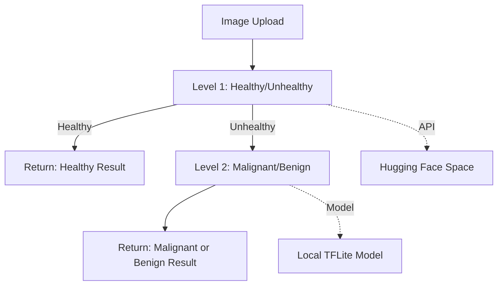

# 🔬 AI-Powered Oral Lesion Classification - Implementation Guide

A comprehensive full-stack web application for intelligent oral lesion classification using a **two-level AI pipeline**.

---

## 📁 Project Architecture

```
AI-Powered-Oral-Lesion-Classification/
├── backend/                    # Flask REST API
│   ├── app.py                  # Main Flask application
│   ├── requirements.txt        # Python dependencies
│   ├── models/
│   │   └── malignant_benign.tflite  # TFLite model
│   └── utils/
│       └── model_handler.py    # TFLite inference handler
│
├── frontend/                   # React + Vite application
│   ├── src/
│   │   ├── App.jsx             # Root component with routing
│   │   ├── main.jsx            # React entry point
│   │   ├── index.css           # Global styles
│   │   ├── components/         # Reusable UI components
│   │   ├── pages/              # Route pages
│   │   ├── services/           # External API services
│   │   └── utils/              # Utility functions
│   ├── package.json
│   └── vite.config.js
│
└── malignant_benign (1).tflite # TFLite model (root copy)
```

---

## 🧠 Two-Level Classification Pipeline



| Level | Classification | Model Location | Technology |
|-------|---------------|----------------|------------|
| **Level 1** | Healthy vs Unhealthy | Hugging Face Spaces | `gradio_client` API |
| **Level 2** | Malignant vs Benign | Local `.tflite` file | TensorFlow Lite |

---

## 🔧 Backend Implementation

### Core Files

#### [app.py](file:///c:/Users/PRANEEL%20K.A/Desktop/Oral%20lesion/oral%20health/AI-Powered-Oral-Lesion-Classification/backend/app.py)

**Flask REST API with CORS support**

| Endpoint | Method | Description |
|----------|--------|-------------|
| `/api/health` | GET | Health check |
| `/api/classify` | POST | Full two-level classification pipeline |
| `/api/classify/level2` | POST | Direct malignant/benign classification |

**Key Functions:**
- `get_gradio_client()` - Singleton Gradio client for Hugging Face API
- `classify_healthy_unhealthy(image_bytes)` - Level 1 classification via HF Spaces
- `classify_lesion()` - Main endpoint orchestrating both levels

**CORS Origins:**
- `localhost:5173`, `localhost:5174`, `localhost:3000`
- Vercel deployments

---

#### [model_handler.py](file:///c:/Users/PRANEEL%20K.A/Desktop/Oral%20lesion/oral%20health/AI-Powered-Oral-Lesion-Classification/backend/utils/model_handler.py)

**TFLite Model Handler for Level 2 Classification**

```python
CLASS_LABELS = ['benign', 'malignant']  # Index 0 = Benign, Index 1 = Malignant
```

**`MalignantBenignClassifier` Class:**
| Method | Purpose |
|--------|---------|
| `load_model()` | Initialize TFLite interpreter |
| `preprocess_image()` | Resize to 304×304, convert to RGB, float32 |
| `predict()` | Run inference, return classification & confidence |

**Image Preprocessing:**
- Resize: `304x304` pixels
- Color: RGB
- Data type: `float32` (0-255 range, NOT normalized)
- Batch dimension added via `np.expand_dims()`

---

### Backend Dependencies

```txt
flask==3.0.0
flask-cors==4.0.0
tensorflow==2.20.0
pillow>=10.4.0
requests==2.31.0
numpy>=1.26.0
gunicorn>=21.0.0
gradio_client>=0.10.0
```

---

## ⚛️ Frontend Implementation

### Technology Stack

| Technology | Version | Purpose |
|------------|---------|---------|
| React | 19.2.0 | UI framework |
| Vite | 7.2.4 | Build tool |
| Tailwind CSS | 4.1.18 | Styling |
| Axios | 1.13.2 | HTTP client |
| React Router DOM | 7.11.0 | Routing |
| GSAP | 3.14.2 | Animations |
| jsPDF | 4.0.0 | PDF generation |
| groq-sdk | 0.8.1 | GROQ AI API |
| OGL | 1.0.11 | WebGL graphics |

---

### Core Components

#### [App.jsx](file:///c:/Users/PRANEEL%20K.A/Desktop/Oral%20lesion/oral%20health/AI-Powered-Oral-Lesion-Classification/frontend/src/App.jsx)

**Root component with routing configuration**

```jsx
Routes:
  "/" → HomePage
  "/analysis" → AnalysisPage  
  "/about" → AboutPage
```

Features:
- `RippleGrid` animated background (WebGL-based)
- Fixed background with content layer above
- Global `Navbar` component

---

### Pages

#### [AnalysisPage.jsx](file:///c:/Users/PRANEEL%20K.A/Desktop/Oral%20lesion/oral%20health/AI-Powered-Oral-Lesion-Classification/frontend/src/pages/AnalysisPage.jsx)

**Main analysis interface with multi-step workflow**

| State | Purpose |
|-------|---------|
| `selectedImage`, `imagePreview` | Image file handling |
| `analysisResult` | API response data |
| `isAnalyzing` | Loading state |
| `patientData` | Patient form data |

**Key Functions:**
- `handlePatientDataChange()` - Form input handler
- `toggleSymptom()` - Checkbox toggle for symptoms
- `handleImageSelect()` - Image upload handler
- `analyzeImage()` - POST to `/api/classify` endpoint
- `handleReset()` - Clear state for new analysis

**Patient Data Form Fields:**
- Name, Age, Gender
- Symptoms (checkboxes)
- Duration of issue
- Additional notes

---

#### [HomePage.jsx](file:///c:/Users/PRANEEL%20K.A/Desktop/Oral%20lesion/oral%20health/AI-Powered-Oral-Lesion-Classification/frontend/src/pages/HomePage.jsx)

Landing page with feature highlights and CTA buttons.

#### [AboutPage.jsx](file:///c:/Users/PRANEEL%20K.A/Desktop/Oral%20lesion/oral%20health/AI-Powered-Oral-Lesion-Classification/frontend/src/pages/AboutPage.jsx)

Information about the project, team, and technology.

---

### UI Components

#### [ResultCard.jsx](file:///c:/Users/PRANEEL%20K.A/Desktop/Oral%20lesion/oral%20health/AI-Powered-Oral-Lesion-Classification/frontend/src/components/ResultCard.jsx)

**Displays analysis results with AI suggestions**

| Feature | Implementation |
|---------|----------------|
| Result Display | Color-coded health status (healthy/benign/malignant) |
| AI Suggestions | Fetched from Gemini API |
| PDF Report | Download medical report via jsPDF |
| Confidence Bars | Visual confidence indicators |

**Key Functions:**
- `fetchSuggestions()` - Calls `generateOralHealthSuggestions()`
- `getResultConfig()` - Returns colors/icons based on result type
- `handleDownloadReport()` - Generates PDF via `generateMedicalReport()`

---

#### [ImageUploader.jsx](file:///c:/Users/PRANEEL%20K.A/Desktop/Oral%20lesion/oral%20health/AI-Powered-Oral-Lesion-Classification/frontend/src/components/ImageUploader.jsx)

Drag-and-drop image upload with preview.

#### [Stepper.jsx](file:///c:/Users/PRANEEL%20K.A/Desktop/Oral%20lesion/oral%20health/AI-Powered-Oral-Lesion-Classification/frontend/src/components/Stepper.jsx)

Multi-step form wizard for analysis workflow.

#### [Navbar.jsx](file:///c:/Users/PRANEEL%20K.A/Desktop/Oral%20lesion/oral%20health/AI-Powered-Oral-Lesion-Classification/frontend/src/components/Navbar.jsx)

Navigation bar with logo and route links.

#### [RippleGrid.jsx](file:///c:/Users/PRANEEL%20K.A/Desktop/Oral%20lesion/oral%20health/AI-Powered-Oral-Lesion-Classification/frontend/src/components/RippleGrid.jsx)

WebGL-based animated grid background with mouse interaction.

#### [DarkVeil.jsx](file:///c:/Users/PRANEEL%20K.A/Desktop/Oral%20lesion/oral%20health/AI-Powered-Oral-Lesion-Classification/frontend/src/components/DarkVeil.jsx)

Overlay component for modal dialogs.

---

### Services

#### [geminiService.js](file:///c:/Users/PRANEEL%20K.A/Desktop/Oral%20lesion/oral%20health/AI-Powered-Oral-Lesion-Classification/frontend/src/services/geminiService.js)

**GROQ AI integration for health suggestions**

```javascript
// Uses GROQ Llama 3.3 70B model
const model = "llama-3.3-70b-versatile";
```

**Functions:**
- `initializeGroq()` - Initialize GROQ client
- `generateOralHealthSuggestions(analysisResult)` - Get AI health recommendations
- `getDefaultSuggestions(analysisResult)` - Fallback suggestions if API fails

**Suggestion Format:**
```json
[
  { "title": "Daily Care", "description": "Brush twice daily..." },
  { "title": "Regular Checkups", "description": "Visit dentist..." }
]
```

---

### Utilities

#### [reportGenerator.js](file:///c:/Users/PRANEEL%20K.A/Desktop/Oral%20lesion/oral%20health/AI-Powered-Oral-Lesion-Classification/frontend/src/utils/reportGenerator.js)

**PDF Medical Report Generator using jsPDF**

**Report Sections:**
1. **Header** - OralScan AI branding with red accent
2. **Patient Information** - Name, age, gender, symptoms, duration, notes
3. **Analysis Results** - Level 1 & 2 classifications with confidence
4. **Clinical Summary** - AI-generated health interpretation
5. **Recommendations** - AI suggestions from Gemini
6. **Disclaimer** - Medical advice warning

**Output:** Downloadable PDF file named `OralScan_Report_YYYY-MM-DD.pdf`

---

## 🚀 Running the Application

### Backend Setup

```bash
cd backend

# Create virtual environment
python -m venv myenv

# Activate (Windows)
.\myenv\Scripts\activate

# Activate (macOS/Linux)
source myenv/bin/activate

# Install dependencies
pip install -r requirements.txt

# Run server
python app.py
```

**Server runs at:** `http://localhost:5000`

---

### Frontend Setup

```bash
cd frontend

# Install dependencies
npm install

# Start dev server
npm run dev
```

**App runs at:** `http://localhost:5173`

---

## 🔌 API Usage Examples

### Full Classification

```bash
curl -X POST http://localhost:5000/api/classify \
  -F "image=@path/to/oral_image.jpg"
```

**Response:**
```json
{
  "success": true,
  "level1": {
    "classification": "unhealthy",
    "confidence": 84.37,
    "is_healthy": false
  },
  "level2": {
    "classification": "benign",
    "confidence": 72.5,
    "is_malignant": false
  },
  "final_result": "benign"
}
```

---

## 🌐 Deployment

| Component | Platform | URL Pattern |
|-----------|----------|-------------|
| Backend | Render | `https://ai-powered-oral-lesion-classification.onrender.com` |
| Frontend | Vercel | `https://ai-powered-oral-lesion-classification.vercel.app` |

**Environment Variables:**
- Frontend: `GEMINI_API_KEY` (in `.env`)
- Backend: None required (model path is relative)

---

## 🤖 External Services

| Service | Purpose | Identifier |
|---------|---------|------------|
| Hugging Face Spaces | Level 1 Classification API | `Praneel12/oral-health-classifier` |
| GROQ | Health suggestions AI | `llama-3.3-70b-versatile` |

---

## ⚠️ Important Notes

> [!CAUTION]
> This application is for **educational and research purposes only**. It should NOT be used as a substitute for professional medical diagnosis.

- Always consult qualified healthcare providers for proper evaluation
- The AI predictions are probabilistic and may not be accurate in all cases
- The TFLite model expects 304×304 RGB images with pixel values in 0-255 range
